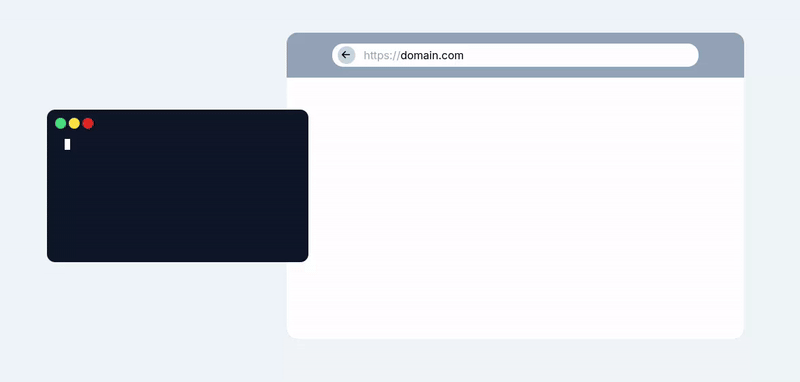
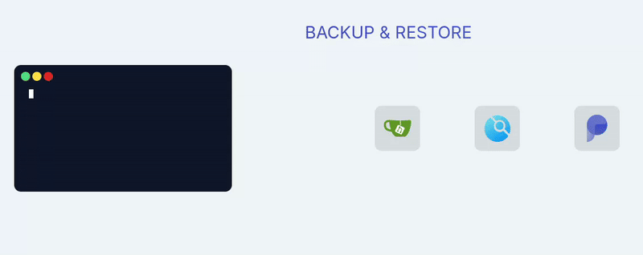

<h1 align="center">
  <picture>
    
  </picture>
  Docker-Web
  <br>
  <br>
    <center>
    A cli for self-hosted docker compose.yaml stack-oriented manager.
  </center>
</h1>

<h2>Install</h2>

```bash
curl https://raw.githubusercontent.com/docker-web/docker-web/master/install.sh | bash
```

<h3>Manual</h3>

```bash
Core Commands:
usage: docker-web <command>

  help      -h       Print help
  version   -v       Print version
  upgrade            Upgrade docker-web
  uninstall          Uninstall docker-web
  config             Assistant to edit configurations stored in config.sh

App Commands:
usage: docker-web <command> <app_name>
       docker-web <command> (command will be apply for all apps)

  up                 launch or update app
  install            download and launch app from the store (https://github.com/docker-web/docker-web/tree/master/store)
  create             create <app_name> <dockerhub_image_name> (based on https://github.com/docker-web/docker-web/tree/master/store/template)
  init               init app in the current directory (based on https://github.com/docker-web/docker-web/tree/master/store/template)
  backup             archive app in backup folder (for distant backup '--remote user@server.domain')
  restore            restore app (for distant restore '--remote user@server.domain')
  ls                 list app(s) running
  dl                 download app from the store (https://github.com/docker-web/docker-web/tree/master/store)
  reset              down app and remove containers and volumes
  rm                 reset app and remove its folder
  *                  restart stop down rm logs pull ... any docker-compose commands are compatible
```

<h3>Tree</h3>

```bash
.
├── config.sh                              user configurations
├── store                                  apps store folder
├── media                                  media datas folder
└── backup                                 backed-up apps folder
```

<h3>Demos:</h3>

<h4>Start/stop a service:</h4>

<h4>Backup/restore a service:</h4>

<h1 align="center">
  <br>
    <center>
    Store for Docker-web apps
  </center>
</h1>
<h4>
the store folder is design to store docker-web apps,
an app is a pre-configured docker-compose web application following the structure details below.
</h4>
<h3>Structure:</h3>

```bash
 store/
  ├─ app_name/
  │   ├── config.sh                      app configurations
  │   ├── docker-compose.yml             app docker structure
  │   ├── logo.svg                       app icon
  │   ├── nginx.conf                     nginx configurations (optional)
  │   ├── post-install.sh                script executed before the app is launched (optional)
  │   ├── pre-install.sh                 script executed after the app is launched (optional)
  │   └── README.md
  ├─ _archives/
  │   ├─ app-1.tar.gz              tarballs of apps ready to be downloaded from a docker-web instance (auto generated)
  │   ├─ app-2.tar.gz
  │   └─ index.json                              list of available apps in store (auto generated)
```
