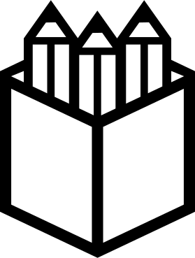

<h1 align="center">
  <picture>
    
	<h4 align="center" style="font-size: 20px">hackable self-hosting</h4>
  </picture>
</h1>

## Install
`curl -L get.pegaz.dev | sudo bash`

## Deploy service
`pegaz up  nextcloud`
`pegaz stop nextcloud`

## Backup & Restore service
`pegaz backup  nextcloud`
`pegaz restore nextcloud`

## Create service
`pegaz create $NAME`

## Dev
`git clone https://github.com/valerebron/pegaz.git`
`sudo bash get.pegaz.dev`
now you can use the special command 'dwebdev'
`dwebdev ...`

then you can edit config in services/grav/

## Help
- If you need to renew the certs of a service, `docker exec proxy rm -rf /etc/nginx/certs/name_of_service`
- If you use drone to deploy, user will be root so you may need : `sudo chown -R user:user /opt/pegaz/name_of_service`
- If you use drone to deploy, dashboard may broke so : `sudo chmod -R 777 /opt/pegaz/services/dashboard`

## Features
- 🔒 ssl certification
- 🎉 sub-domain & multi-domain directly in docker-compose file
- 📝 pre & post install script
- 📦 backup / restore volumes
- 🤖 pre-configure apps user account

## Pre-configured applications

  
  
  
  
  
  
  
  
  
 

## Introduction

In extending docker-compose functionnality, pegaz let you control multiple docker-compose.yml configurations.

Pegaz add also a <b>proxy</b>, a <b>port manager</b> and a <b>backup system</b>.

The goal is to facilitate the deployment of web-services by :

1. Centralize docker-compose usage

An easiest way to deploy and manage apps, is containerization and docker-compose is a popular way to do it.
Docker-compose allow you to
 - launch multiple services at once
 - put all settings of your app in one file (infrastrucure as code)
 - set ports forwarding

The drawback of docker-compose is to launch services set in only one file.
Gathered all your apps settings in the same file make it difficult to maintain and manage one service at a time.

Pegaz provide a command line interface to split services configurations but also to manage all of them with one command line interface.

2. Proxy & SSL certificates
    - automatic
    - sub domain
    - redirection

3. Create a service
    default configuration
    dockerhub functionnality
    quick way to test services
		try: `pegaz create ghost` or `pegaz create grav` or `pegaz create wordpress` or `pegaz create drupal`

4. Configure a service
    Custom Nginx Configuration
    port forwarding
    pre and post install script

## Why infrastructure as code ?
- easy to collaborate as all the settings are in the code repo
- easy to install & remove
- easy to backup
- easy for software upgrade 
- easy for hardware upgrade 

## Configuration
### DNS
`A domain.com serverIP`
`A *.domain.com serverIP`
### Router Config
Redirect port 7700 to 8112
from all ip address to the serverIP address

## Whant to contribute ?
help is needed for those features :
- security test
- apply Docker secret
- Windows / MacOS compatibility (migrate pegaz in a container & create insall scripts)
- ARM 64 compatibility

## TODO

pegaz.dev

- [ ] reaplce rss by https://github.com/taroved/pol/blob/master/docker-compose.yaml
- [ ] auto attribute port to project
- [ ] Clarify doc for drone install in drone/post-install.sh
- [x] pegaz post_install -> POST_INSTALL
- [x] pegaz preinstall -> PRE_INSTALL
- [x] pegaz addtohost -> ADD_TO_HOSTS
- [ ] backup / restore ACL ?
- [ ] nextcloud Security & setup warnings
- [x] collabora code with HTTPS
- [x] radio
- [ ] clamav
- [ ] Email server https://github.com/docker-mailserver/docker-mailserver#examples

- [x] github nextcloud mail fix
- [x] fix massivemussic front/back link
- [x] proxy bug: cause: funknews push solution: pegaz up proxy
- [x] prepare a front website as portfolio/cv : OnePager : un repo qui up des page sur un fichier html (pegaz.io ustube.github page valerebron.com)
- [ ] pegaz template app :: a vite vue front / a nest prisma back / a 
- [x] manage drone massive logs (proxy       | nginx.1     | drone.erudi.fr 192.168.1.254 - - [26/Oct/2022:08:43:57 +0000] "POST /rpc/v2/stage HTTP/2.0" 401 0 "-" "Go-http-client/2.0" "192.168.16.9:80")
- [x] CRON: > /var/log/syslog && > /var/log/daemon
- [x] server CODE https://github.com/linuxserver/docker-code-server
- [x] RSS: https://hub.docker.com/r/rssbridge/rss-bridge / https://github.com/GetStream/Winds- 
- [x] DELUGE
	- [x] plugins auto add label etc
	- [x] dark theme
	- [x] forwarded web port
- [x] fix penpot assets folder
- [x] backup : pre-commit ? loop service + update version
- [x] No such container: dashboard
- [x] the last port used is 8112
- [x] 18h30 -> photo de l'aiguilleur (imprimer à l'école)
- [x] deluge css
- [x] deluge delete google fonts
- [x] redirect all sub domain invalide
- [x] Logo v1
- [x] gitea push access
- [x] drone with gitea
- [x] funknews CI
- [x] pegaz dashboard
- [x] get last port should be aware of all port reserved by services not launched
- [x] WEB
- [x] bloquer les versions d'images
- [x] CLI: auto add /etc/hosts (git.domain.com)
- [x] GUI : Data Archi & UI / UX

- [x] Gitea
	- [x] web sub-domain
	- [x] web https
	- [x] ssh clone
	- [x] user creation
	- [x] drone CI
- [x] PROXY: nginx config ok ?
- [x] change domain ?
- [x] REDIRECTIONS: after config change domain ? drop proxy volumes
- [x] Docker - duplicate mount point
- [x] better use HTTPS_METHOD=nohttps & HTTPS_METHOD=noredirect
- [x] /etc/gitlab-runner/config.toml: no such file
- [x] backup a service
	- [x] basic backup
	- [x] basic restore
	- [x] test if service exist before backup or restore
	- [x] start -> if state null -> up
	- [x] ls vertical
	- [x] pause for backup & stop for restore
	- [x] do not ask for root (/var/lib/docker/volumes), store volume on pegaz folder ?
	- [x] tar service by xervice & not volume by volume ?
- [x] gitlab latest 
- [x] GITLAB backup
- [x] GITEA http
- [x] PENPOT auto create user
- [x] RADIO
- [x] if pull crash -> do not create
- [x] MOUNT DATADIR by DEFAULT ?
- [x] CLEAN : add local to local var
- [x] HELPER: get state of a service
- [x] CMD State
- [x] state restarting
- [x] upgrade -> do not drop code (git add+commit || git diff ...)
- [x] block pegaz if config by default
- [x] REFACTO
- [x] pegaz cli should not ask for admin right (only upgrade & uninstall)
- [x] manage error if image doesn't exist
- [x] completion for create image name
- [x] complete compat (arch & cie)
- [x] if service name already exist
- [x] debug destroy
- [x] if create answer not in range
- [x] uninstall / destroy RU sure ?
- [x] split code by command & not args
- [x] assign each command to a function
	- [x] - pegaz ls: list all services with state (start/stop/fail)
	- [x] pegaz config
	- [x] ls start stop install remove help
	- [x] static redirection with nginx and env file
		- [x] env file
		- [x] nginx simple redirect
		- [x] nginx subdomain redirect
	- [x] update (exclude env.sh)
	- [x] ps
- [x] get default image port ?
- [x] get first image hub docker name
- [x] try default ports ?
- [x] plausible edit compose.yml
- [x] pre-install.sh ?
	- [x] create a service
		- [x] pegaz create
	- [x] Main domain + sub-domain || only maindomain
	- [x] MAIN_DOMAIN_SERVICE ------> just add extra-domain or alias-domain to config.sh
	- [x] postdomain on non-master container
	- [x] pegaz down test :: command down not found
	- [x] env.sh
	- [x] auto-completion script
	- [x] add custom service (🗹 PORT ? 🗹 DOMAIN ? 🗹 SUBDOMAIN ?)
	- [x] auto completion
	- [x] auto mount proxy & vhost config files
	- [x] post-install.sh script auto mount
	- [x] hook for post-install (test function ? package installed ?)
	- [x] RESERVED PORTS for PEGAZ 33000 -> 33400
	- [x] pegaz add -> echo sub.domain & localhost:port
	- [x] pegaz custom port range 77000 -> 77999 10ports / app
	- [x] pegaz mutli domain test
	- [x] easy way to add custom link
	- [x] deploy with docker (image: docker-compose) ?
- [x] jellyfin
- [x] nextcloud
	- [x] AIO manual : https://github.com/nextcloud/all-in-one/blob/main/manual-install/latest.yml
	- [x] 1st auto install
	- [x] 2nd share links
	- [x] 3rd office
	- [x] upload big file
	- [x] php cli memory
	- [x] post-install script ?
		- [x] post-install at first up
		- [x] set DATA_DIR as default folder ?
		- [x] disable photos
	- [x] install hub bundle
	- [x] file: can delete file ? chmod 755 ? chown ?
	- [x] install external drive
	- [x] config collabora
	- [x] docker-php-ext-install FFI for storj
- [x] penpot ? https://help.penpot.app/technical-guide/getting-started/
	- [x] fix proxy
	- [x] pre install user
	- [x] bind bdd port
- [x] Plausible https://plausible.io/
- [x] nextcloud/libreoffice
- [x] yunohost https://yunohost.org/en/apps
- [x] tester un premier domaine en https
- [x] ajouter des domaines automatiquements
- [x] configurateur de sous domaines
- [x] ajouter des domaines manuellement
- [x] ajouter un domaine depuis un autre/docker-compose ? config file ?
- [x] ajouter nextcloud
- [x] tester multi compose file
- [x] set download folder to 777
- [x] portainer to manage docker ? (Switch off, restart, update) https://github.com/valerebron/usetube/issues/16

